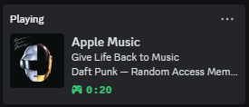

# apple-music-discord-rpc

## Apple Music Discord Rich Presence

This project integrates Apple Music with Discord Rich Presence to display detailed playback information about your current track directly in your Discord profile. It parses process data directly from the application and feeds it to a Discord RPC client to update your activity status. Specifics of implementation vary with OS.

## Features

- Displays the currently playing track on Apple Music in Discord Activity Status.
- Includes track title, artist, album, and a progress bar showing elapsed time.
- Dynamically updates information when the track changes.

### Mac OS

- Full `Typescript` implementation
- `.applescript` utilized to gather process data via internal API
- `Node.js` server manages `Discord RPC` client and periodically updates

#### Steps to Install & Run (Mac)

1. From inside main directory: `cd mac/`
2. Install packages via: `npm install`
3. Build and run code via: `npm run build && npm run start`

### Windows

- `Python3` manager to extract relevant information from Apple Music application "process"
- `Flask` (`Python3`) server hosts local API to streamline data communication
- `Javascript` and `Node.js` server manages `Discord RPC` client and updates via data fetched from local `Flask` server.

#### Steps to Install & Run (Windows)

1. From inside main directory: `cd backend`
2. Install Python libraries: `pip install -r requirements.txt`
3. Nagivate to Node.js server from main directory: `cd discord-rpc`
4. Install Node.js packages: `npm install`
5. Start server by executing `run.bat`: `run.bat`

## Acknowledgements

- [discordjs/RPC](https://github.com/discordjs/RPC)
- [pywinauto](https://github.com/pywinauto/pywinauto)
