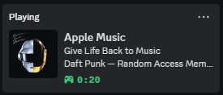

# apple-music-discord-rpc

## Apple Music Discord Rich Presence

This project integrates Apple Music with Discord Rich Presence to display detailed playback information about your current track directly in your Discord profile. It parses process data directly from the application and feeds it to a Discord RPC client to update your activity status. Specifics of implementation vary with OS.

## Features

- Displays the currently playing track on Apple Music in Discord Activity Status.
- Includes track title, artist, album, and a progress bar showing elapsed time.
- Dynamically updates information when the track changes.

- Both the Mac OS and Windows implementation follow the same project structure,
but utilize different methods of interfacing with the Apple Music application.

### Mac OS

- Full `Typescript` server implementation
- `.applescript` utilized to gather process data via internal API
- `Node.js` server manages `Discord RPC` client and periodically updates

#### Steps to Install & Run (Mac)

1. From inside main directory: `cd mac/`
2. Install packages via: `npm install`
3. Build and run code via: `npm run build && npm run start`
4. Once built, code can be re-run via: `npm run start`

### Windows

- Full `Typescript` server implementation
- `Python3` script used to access [Windows GSMTC](https://learn.microsoft.com/en-us/uwp/api/windows.media.control.globalsystemmediatransportcontrolssession?view=winrt-26100) API
- `Node.js` server manages `Discord RPC` client and periodically updates

#### Steps to Install & Run (Windows)

1. From inside main directory: `cd windows`
2. Create and setup Python environment. Requires `Python 3.9`
    - via: `npm run setup:python`
3. Build `.ts` files via: `npm run build`
4. Run code via: `npm run start`

## Versions

### v0.2 (Active)

- Windows and Mac implementations
- Single (node) server manages data extraction and updating activity
- More accurate, reliable and performant data extraction achieved by utilizing
OS-specific APIs.

### v0.1

- Windows only implementation due application data extraction methods (pywinauto)
- Discord-RPC server and application data extraction were run on two
separate servers.
- Servers interacted and shared data via local API endpoints
- Worked, but prone to reconnection errors and slow data extraction

## Acknowledgements

- [discordjs/RPC](https://github.com/discordjs/RPC)
- [pywinauto](https://github.com/pywinauto/pywinauto)
